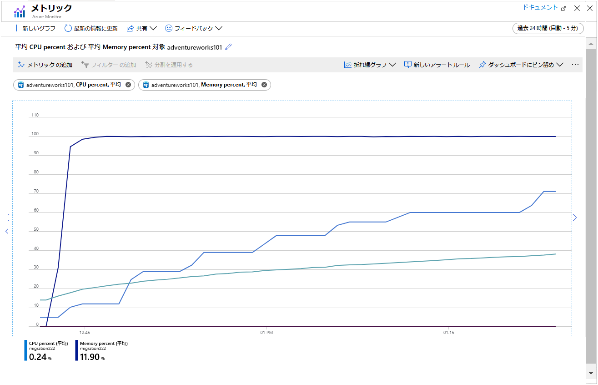

---
lab:
    title: '移行されたデータベースの監視とチューニング'
    module: 'モジュール 4: 監視とチューニングの保護'
---

# ラボ: 移行されたデータベースの監視とチューニング

## 概要

このラボでは、このモジュールで学習した情報を使用して、以前に移行したデータベースを監視および調整します。データベースを読み取り負荷の高いワークロードに対象とするサンプル アプリケーションを実行し、Azure で使用可能なメトリックを使用して結果を監視します。クエリ ストアを使用して、クエリのパフォーマンスを考察します。次に、読み取りレプリカを構成し、一部のクライアントの読み取り処理をレプリカにオフロードします。次に、この変更がパフォーマンスに与える影響を考察します。

## 目標

このラボを完了すると、次のことができるようになります。

1. Azure メトリックを使用してパフォーマンスを監視します。
2. Query Store を使用して、クエリのパフォーマンスを考察します。
3. 一部のユーザーの読み取り操作をオフロードして、リードレプリカを使用します。
4. 再びパフォーマンスを監視し、結果を評価します。

## シナリオ

あなたは AdventureWorks 社のデータベース開発者として働いています。AdventureWorks は、10年以上にわたり、エンド コンシューマーやディストリビューターに自転車や自転車部品を直接販売してきました。AdventureWorks のシステムは、以前に Azure Database for PostgreSQL に移行したデータベースに情報を格納します。

これを実行した後、システムのパフォーマンスが良好であることを確認する必要があります。あなたは、サーバーを監視するために使用可能な Azure ツールを使用することにしました。そこで、競合と待機時間によって発生する応答時間が遅くなる可能性を軽減するために、読み取りレプリケーションを実装することにしました。また、結果のシステムを監視し、結果を単一のサーバー アーキテクチャと比較する必要があります。

## セットアップ

このラボでは、モジュール 3 からラボが完了したことを前提としており、このラボで作成された Azure Database for PostgreSQL サーバーとデータベースを使用します。このラボを完了していない場合は、次のセットアップ手順を実行してください。Azure Database for PostgreSQL サーバーが動作していて、AdventureWorks データベースをこのサーバーに正常に移行した場合は、演習 1 を直接設定します。

1. 教室環境で実行されている **LON-DEV-01** 仮想マシンにサインインします。ユーザー名は **azureuser**、パスワードは **Pa55w.rd**  です。

2. ブラウザーを使用して、Azure portal にサインインします。

3. Azure Cloud Shell ウィンドウを開く **Bash** シェルが実行していることを確認します。

4. Cloud Shell 内で、スクリ6プトとサンプル データベースを保持するリポジトリのクローンを作成します (まだ作成していない場合)。

    ```bash
    git clone https://github.com/MicrosoftLearning/DP-070-Migrate-Open-Source-Workloads-to-Azure ~/workshop
    ```

5. *workshop/migration_samples/setup/postgresql* フォルダーに移動します。

    ```bash
    cd ~/workshop/migration_samples/setup/postgresql
    ```

6. 次のコマンドを実行します。*[nnn]* を数値に置き換えます。この際、スクリプトによって作成された Azure Database for PostgreSQL サーバーが一意の名前を持つことを確認します。サーバーは、スクリプトの 2 番目のパラメーターとして指定する Azure リソース グループに作成されます。このリソース グループがまだ存在しない場合は、この時点で作成されます。必要に応じて、リソース グループの場所を 3 番目のパラメーターとして指定します。パラメーターが省略されている場合、この場所はデフォルトで "westus" となります。

    ```bash
    bash copy_adventureworks.sh adventureworks[nnn] [resource_group_name] [location]
    ```

7. *awadmin* パスワードの入力を求めるメッセージが表示されたら、**「Pa55w.rdDemo」** と入力します。 

8. *azureuser* パスワードの入力を求めるメッセージが表示されたら、**Pa55w.rd** と入力します。 

9. 次へ進む前に、スクリプトが完了するのを待ちます。これには 5 ~10 分かかり、「**セットアップが完了しました**」というメッセージで終了します。

## エクササイズ 1: Azure メトリックを使用してパフォーマンスを監視する

このエクササイズでは、次のタスクを実行します。

1. Azure Database for PostgreSQL サービスの Azure メトリックを構成します。
2. データベースを照会する複数のユーザーをシミュレートするサンプル アプリケーションを実行します。
3. メトリックを表示します。

### タスク 3: Azure Database for PostgreSQL サービスの Azure メトリックの構成

1. **azureuser** ユーザーとして教室環境で実行されている **LON-DEV-01** 仮想マシンに、パスワード **Pa55w.rd** を使用してサインインします。

2. Web ブラウザーを使用して、Azure portal にサインインします。

3. Azure portal で、Azure Database for PostgreSQL サービスのページに移動します。

4. 「**監視**」 で、「**メトリック**」 をクリックします。

5. チャート ページに、次のメトリックを追加します。

    | プロパティ  | 値  |
    |---|---|
    | リソース | adventureworks[nnn] |
    | メトリック名前空間:  | PostgreSQL サーバー標準メトリック |
    | メトリック | アクティブな接続 |
    | 集計 | 平均 |

    このメトリックは、1 分ごとのサーバーへの接続の平均数を表示します。

6. 「**メトリックの追加**」 をクリックし、次のメトリックを追加します。

    | プロパティ  | 値  |
    |---|---|
    | リソース | adventureworks[nnn] |
    | メトリック名前空間:  | PostgreSQL サーバー標準メトリック |
    | メトリック | CPU パーセント |
    | 集計 | 平均 |

7. 「**メトリックの追加**」 をクリックし、次のメトリックを追加します。

    | プロパティ  | 値  |
    |---|---|
    | リソース | adventureworks[nnn] |
    | メトリック名前空間:  | PostgreSQL サーバー標準メトリック |
    | メトリック | メモリの割合 |
    | 集計 | 平均 |

8. 「**メトリックの追加**」 をクリックし、次のメトリックを追加します。

    | プロパティ  | 値  |
    |---|---|
    | リソース | adventureworks[nnn] |
    | メトリック名前空間:  | PostgreSQL サーバー標準メトリック |
    | メトリック | IO パーセント |
    | 集計 | 平均 |

    最後の 3 つのメトリックは、テスト アプリケーションによってリソースがどのように消費されているかを示します。

9. グラフの時間範囲を 「**最後の 30 分**」 に設定します。

10. 「**ダッシュボードにピン留めする**」 をクリックし、「**現在のダッシュボードにピン留めする**」 をクリックします。 

### タスク 3: データベースを照会する複数のユーザーをシミュレートするサンプル アプリケーションを実行する

1. Azure portal で、Azure Database for PostgreSQL サーバーのページ で、「**設定**」 の下にある 「**接続文字列**」 をクリックします。  ADO.NET 接続文字列をクリップボードにコピーします。

2. Azure Cloud Shell に切り替えます。スクリプトとサンプル データベースを保持するリポジトリのクローンを作成します (まだ作成していない場合)。

    ```bash
    git clone https://github.com/MicrosoftLearning/DP-070-Migrate-Open-Source-Workloads-to-Azure ~/workshop
    ```

3. *~/workshop/migration_samples/code/postgresql/AdventureWorksSoakTest* フォルダーに移動します。

    ```bash
    cd ~/workshop/migration_samples/code/postgresql/AdventureWorksSoakTest
    ```

4. コード エディタを使用して App.config ファイルを開きます。

    ```bash
    code App.config
    ```

5. **ConectionString0** アプリ設定の値をクリップボードの接続文字列に置き換えます。**ユーザー ID** を **azureuser@adventureworks[nnn]** に変更し、 **パスワード** を **Pa55w.rd** に設定します。  完成したファイルは、次のような形式になります：

    ```XML
    <?xml version="1.0" encoding="utf-8" ?>
    <configuration>
        <appSettings>
            <add key="ConnectionString0" value="Server=adventureworks101.postgres.database.azure.com;Database=azureadventureworks;Port=5432;User Id=azureuser@adventureworks101;Password=Pa55w.rd;Ssl Mode=Require;" />
            <add key="ConnectionString1" value="INSERT CONNECTION STRING HERE" />
            <add key="ConnectionString2" value="INSERT CONNECTION STRING HERE" />
            <add key="NumClients" value="100" />
            <add key="NumReplicas" value="1"/>
        </appSettings>
    </configuration>
    ```

    > [!NOTE]
    > この時点では、 **ConnectionString1** および **ConnectionString2** の設定を無視します。   これらの値は、ラボの後半で使用します。

6. 変更を保存し、エディタを閉じます。

7. Cloud Shell プロンプトで、次のコマンドを実行してアプリを構築および実行します。

    ```bash
    dotnet run
    ```

    アプリが起動すると、多数のスレッドが生成されます。各スレッドはユーザーをシミュレートします。スレッドはループを実行し、一連のクエリを実行します。次のようなメッセージが表示され始めます。

    ```text
    Client 48 : SELECT * FROM purchasing.vendor
    Response time: 630 ms

    Client 48 : SELECT * FROM sales.specialoffer
    Response time: 702 ms

    Client 43 : SELECT * FROM purchasing.vendor
    Response time: 190 ms

    Client 57 : SELECT * FROM sales.salesorderdetail
    Client 68 : SELECT * FROM production.vproductanddescription
    Response time: 51960 ms

    Client 55 : SELECT * FROM production.vproductanddescription
    Response time: 160212 ms

    Client 59 : SELECT * FROM person.person
    Response time: 186026 ms

    Response time: 2191 ms

    Client 37 : SELECT * FROM person.person
    Response time: 168710 ms
    ```

    次のタスクとエクササイズ 2 を実行している間はアプリを実行したままにします。

### タスク 3: メトリックの表示

1. Azure portal に戻ります。

1. 左側のウィンドウで、「**ダッシュボード**」 をクリックします。

    Azure Database for PostgreSQL サービスのメトリックを表示するグラフが表示されます。

1. グラフをクリックして、「**メトリック**」 ウィンドウで開きます。 

1. アプリを数分間実行します (長いほど良い)。時間が経つにつれて、グラフのメトリックは次の図に示すパターンのようになります。

    

    このグラフでは、次の点が強調表示されます。

    - CPU はフル キャパシティで実行されています。使用率は非常に速く 100% に達します。
    - 接続数はゆっくりと増加します。サンプル アプリケーションは、101 個のクライアントを連続して起動するように設計されていますが、サーバーは一度に少数の接続を開くことしかできません。グラフの各「ステップ」で追加される接続数は少なくなってきており、「ステップ」の間の時間も増えています。約 45 分後、システムは 70 のクライアント接続しか確立できません。
    - メモリ使用率は、時間の経過とともに一貫して増加しています。
    - IO 使用率はほぼゼロです。クライアント アプリケーションに必要なすべてのデータは、現在メモリにキャッシュされています。
  
    アプリケーションを長時間実行したままにすると、接続が失敗し始め、次の画像に示すエラーメッセージが表示されます。

    

1. Cloud Shell で、Enter キーを押してアプリケーションを停止します。

## エクササイズ 2: Query Store を使用して、クエリのパフォーマンスを考察する

このエクササイズでは、次のタスクを実行します。

1. クエリ パフォーマンス データを収集するようにサーバーを構成します。
2. Query Store を使用してアプリケーションによって実行されるクエリを調べます。
3. Query Store の使用中に発生する待機を調べます。

### タスク 3:  クエリ パフォーマンス データを収集するようにサーバーを構成する

1. Azure portal 内の Azure Database for PostgreSQL のページ で、「**設定**」 の「**サーバー パラメーター**」 をクリック します。 

1. 「**サーバー パラメータ**」 ページで、次のパラメーターを次の表で指定した値に設定します。 

    | パラメーター  | 値  |
    |---|---|
    | pg_qs.max_query_text_length | 6000 |
    | pg_qs.query_capture_mode | ALL |
    | pg_qs.replace_parameter_placeholders | ON |
    | pg_qs.retention_period_in_days | 7 |
    | pg_qs.track_utility | ON |
    | pg_stat_statements.track | ALL |
    | pgms_wait_sampling.history_period | 100 |
    | pgms_wait_sampling.query_capture_mode | ALL |

1. 「**保存**」 をクリックします。

### タスク 3:  Query Store を使用してアプリケーションによって実行されるクエリを調べる

1. Cloud Shell に戻り、サンプル アプリを再起動します。

    ```bash
    dotnet run
    ```

    続行する前に、アプリを 5 分ほど実行します。

1. アプリを実行したまま Azure portal に切り替えます。

1. Azure Database for PostgreSQL サーバーのページで、インテリジェント パフォーマンスの下の **「Query Performance Insight」** をクリック します。 

1. 「**Query Performance Insight**」 ページ内の 「**長期クエリ**」 タブで 「**クエリ数**」 を 10 に設定 し、**Selected by** を 「**avg**」 に設定し、**期間** を 「**最後の 6 時間**」 に設定 します。

1. グラフの上部にある 「**ズームイン**」 ("+" 記号付きの拡大鏡アイコン) を数回クリックして、最新のデータを表示します。 

    アプリケーションの実行期間に応じて、次に示すようにグラフが表示されます。Query Store は、クエリの統計情報を 15 分ごとに集計するため、各バーには、各クエリが 15 分間に消費した相対的な時間が表示されます。

    

1. 各バーの上にマウスオーバーし、その間のクエリの統計情報を表示します。システムがほとんどの時間を費やしている 3 つのクエリは次のとおりです。

    ```SQL
    SELECT * FROM sales.salesorderdetail
    SELECT * FROM sales.salesorderheader
    SELECT * FROM person.person
    ```

    この情報は、システムを監視する管理者に役立ちます。ユーザーとアプリによって実行されるクエリに関する洞察を得ることで、実行中のワークロードを理解し、アプリケーション開発者にコードを改善する方法を推奨することができるようになります。たとえば、アプリケーションが **sales.sales.orderdetail** テーブルから 121,000 行以上をすべて取得する必要は本当にあるのでしょうか。

### タスク 3: Query Store を使用して発生する待機を調べる

1. 「**待機統計**」 タブをクリックします。

1. **期間** を 「**最後の 6 時間**」 に 設定し、「**グループバイ グループ**」 を 「**イベント**」 に設定し、「**グループの最大数**」 を **5** に設定します。

    「**長期クエリ**」 タブと同様に、データは 15 分ごとに集計されます。  次の表は、システムが 2 種類の待機イベントの対象になっていることを示しています。

    - **クライアント: ClientWrite**: この待機イベントは、サーバーがクライアントにデータ (結果) を書き戻しているときに発生します。データベースへの書き込み中に発生した待機は **示していません**。 
    - **クライアント: ClientRead**: この待機イベントは、サーバーがクライアントからのデータ (クエリ要求やその他のコマンド) の読み取りを待機している場合に発生します。データベースからの読み取りに費やされた時間には **関係ありません**。 
  
    
  
    > [!NOTE]
    > データベースへの読み取りと書き込みは、**クライアント** イベントではなく **IO** イベントによって示 されます。  サンプル アプリケーションでは、最初の読み取り後に必要なすべてのデータがメモリにキャッシュされるため、IO 待機は発生しません。メトリックでメモリの不足が示されたら、IO 待機イベントが発生し始める可能性があります。

1. Cloud Shell に戻り、Enter キーを押してサンプル アプリケーションを停止します。

## エクササイズ 3: 一部のユーザーの読み取り操作をオフロードして、リードレプリカを使用する

このエクササイズでは、次のタスクを実行します。

1. Azure Database for PostgreSQL サービスにレプリカを追加します。
2. クライアント アクセスを有効にするようにレプリカを構成します。
3. 各サーバーを再起動します。

### タスク 3: Azure Database for PostgreSQL サービスにレプリカを追加する

1. Azure portal 内の Azure Database for PostgreSQL のページ で、「**設定**」 の 「**レプリケーション**」 をクリック します。

1. 「**レプリケーション**」 ページで、「**+ レプリカを追加**」 をクリック します。 

1. **PostgreSQL サーバー** ページで、 **サーバー名** ボックスに **adventureworks[nnn]-replica1** と入力 し、「**OK**」 をクリックします。 

1. 最初のレプリカが作成されると (数分かかります)、前の手順を繰り返 し、**adventureworks[nnn]-replica2** という名前の別のレプリカを追加します。

1. 続行する前に、両方のレプリカの状態が 「**デプロイ**」 から 「**利用可能**」 に変わるまで待ちます。 

    

### タスク 3: クライアント アクセスを有効にするようにレプリカを構成する

1. **adventureworks[nnn]-replica1** レプリカの名前をクリックします。  このレプリカの Azure Database for PostgreSQL のページが表示されます。

1. 「**設定**」で 、「**接続セキュリティ**」をクリックします 。

1. **接続セキュリティ ページ** で、「**Azure サービスへのアクセスを許可する**」 (Allow access to Azure services) を **ON** に設定し、「**保存**」 をクリックします。この設定により、Cloud Shell を使用して実行するアプリケーションがサーバーにアクセスできるようになります。

1. 設定が保存された場合は、前の手順を繰り返し、Azure サービスが **adventureworks[nnn]-replica2** レプリカにアクセスできるようにしてください。 

### タスク 3: 各サーバーを再起動する

> [!NOTE]
> レプリケーションを構成する場合、サーバーを再起動する必要はありません。このタスクの目的は、各サーバーからメモリと無関係な接続をクリアし、アプリケーションの再実行時に収集されたメトリックが *クリーン* になるようにすることです。

1. **adventureworks*[nnn]** サーバーのページに移動します。

1. 「**概要**」 ページで、「**再起動**」 をクリックします。

1. **サーバーを再起動する** ダイアログ ボックスで、「**はい**」 をクリックします。

1. 次へ進む前に、サービスが再起動されるのを待ちます。

1. 同じ手順に従って、**adventureworks*[nnn]-replica1** と **adventureworks*[nnn]-replica2** サーバーを再起動します。

## エクササイズ 4: 再びパフォーマンスを監視し、結果を評価する

このエクササイズでは、次のタスクを実行します。

1. レプリカを使用するようにサンプル アプリケーションを再構成します。
2. アプリを監視し、パフォーマンス メトリックの違いを確認します。

### タスク 3: レプリカを使用するようにサンプル アプリケーションを再構成する

1. Cloud Shell で、App.config ファイルを編集します。

2. **ConnectionString1** と **ConnectionString2** 設定の接続文字列を追加します。これらの値は **ConnectionString0** の値と同じである必要があります が、**サーバー** と **ユーザー ID** で要素のテキスト **adventureworks[nnn]** が **adventureworks[nnn]-replica1** と **adventureworks[nnn]-replica2** に置き換えられています。

3. **NumReplicas** を **3** に設定 します。

    App.config ファイルは次のようになります:

    ```XML<?xml version="1.0" encoding="utf-8" ?>
    <configuration>
        <appSettings>
            <add key="ConnectionString0" value="Server=adventureworks101.postgres.database.azure.com;Database=azureadventureworks;Port=5432;User Id=azureuser@adventureworks101;Password=Pa55w.rd;Ssl Mode=Require;" />
            <add key="ConnectionString1" value="Server=adventureworks101-replica1.postgres.database.azure.com;Database=azureadventureworks;Port=5432;User Id=azureuser@adventureworks101-replica1;Password=Pa55w.rd;Ssl Mode=Require;" />
            <add key="ConnectionString2" value="Server=adventureworks101-replica2.postgres.database.azure.com;Database=azureadventureworks;Port=5432;User Id=azureuser@adventureworks101-replica2;Password=Pa55w.rd;Ssl Mode=Require;" />
            <add key="NumClients" value="100" />
            <add key="NumReplicas" value="3"/>
        </appSettings>
    </configuration>
    ```

4. ファイルを保存し、エディタを閉じます。

5. アプリを再度実行します。

    ```bash
    dotnet run
    ```

    アプリケーションは以前と同様に実行されます。ただし、今回は、要求が 3 つのサーバーに分散されます。

6. 続行する前に、アプリを数分間実行します。

### タスク 3: アプリを監視し、パフォーマンス メトリックの違いを確認する

1. アプリを実行したまま Azure portal に戻ります。

2. 左側のウィンドウで、「**ダッシュボード**」 をクリックします。

3. グラフをクリックして、「**メトリック**」 ウィンドウで開きます。

    このグラフには adventureworks*[nnn]* サーバーのメトリックは表示されますが、レプリカは表示されません。各レプリカの負荷は、ほとんど同じである必要があります。

    グラフの例は、起動から 30 分間にわたってアプリケーションについて収集されたメトリックを示しています。このグラフは、CPU 使用率は依然として高いが、メモリ使用率が低くだっていることを示しています。さらに、約 25 分後、システムは 30 を超える接続の接続を確立しました。これは、45 分後に 70 接続をサポートしていた以前の構成と比較すると、好ましいとは思えないかもしれません。しかし、ワークロードは 3 つのサーバーに分散され、すべてが同じレベルで実行され、101 接続すべてが確立されました。さらに、システムは接続障害を報告することなく実行を継続できました。

    

    CPU 使用率の問題に対処するには、より多くの CPU コアを提供するより高い価格レベルにスケールアップすることが可能です。このラボで使用するシステム例は、2 つのコアを提供する **Basic** 価格レベルを使用して実行されます。  **General Purpose** 価格レベルに変更すると、最大 64 コアが提供されます。 

4. Cloud Shell に戻り、Enter キーを押してアプリを停止します。

ここでは、Azure portal の使用してサーバーのアクティビティを監視する方法について学習しました。また、レプリケーションを構成する方法を学び、読み取り専用レプリカを作成すると、読み取り集中型のシナリオでワークロードを分散できることについても学習しました。
